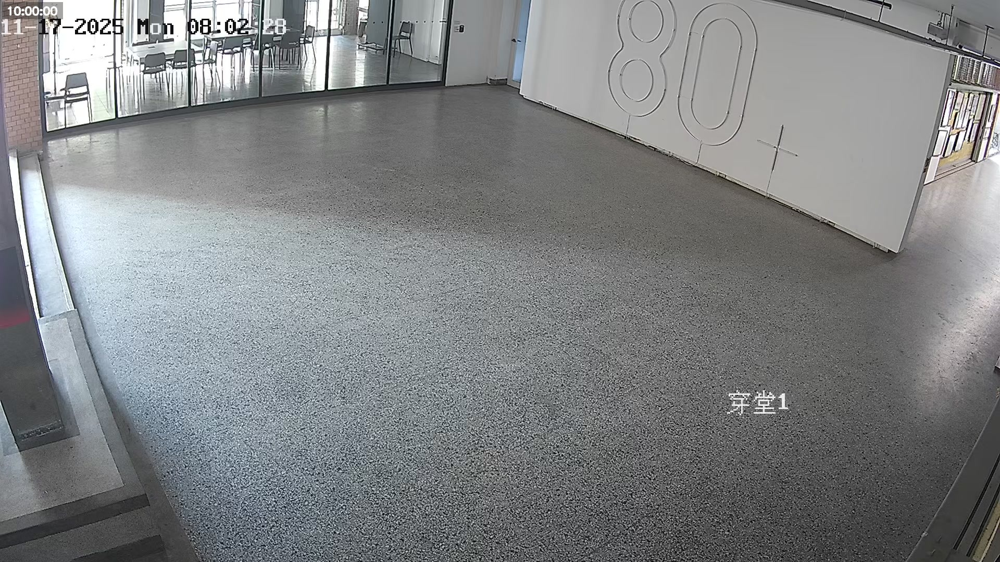
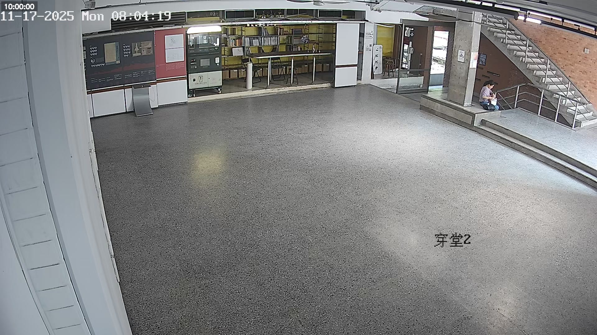
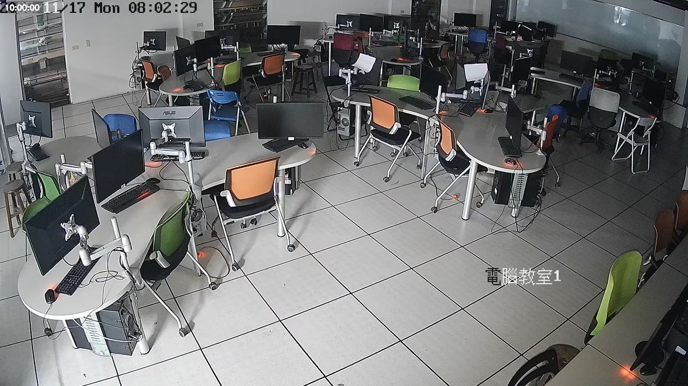

# mcas_carbon_v2

人流追蹤與熱力圖生成系統

## 環境安裝

### 1. 安裝 Python
建議使用 Python 3.9 或以上版本

### 2. 安裝依賴套件
```bash
pip install -r requirements.txt
```

### 3. 下載 YOLO 模型
將 `yolov9e.pt` 模型檔案放置於專案根目錄

---

## 使用方法

### 圖片處理 (main_image.py)

處理單張圖片並生成追蹤結果和熱力圖：

```bash
python main_image.py --image <圖片路徑> --config <場域配置>
```

**參數說明：**
- `--image`：輸入圖片路徑
- `--config`：場域配置名稱 (見下方場域對應)
- `--output_prefix`：輸出檔案前綴名

**範例：**
```bash
python main_image.py --image input/images/1104/1.jpg --config hall_1
```

**輸出檔案：**
- `<prefix>_track_out.png`：追蹤結果圖
- `<prefix>_heat_out.png`：熱力圖
- `<prefix>_count.txt`：人數統計
- `<prefix>_result.json`：JSON 格式結果

---

## 場域對應

| 場域名稱 | 配置名稱 | 參考圖片 |
|---------|---------|---------|
| 穿堂1 | `hall_1` |  |
| 穿堂2 | `hall_2` |  |
| 階梯教室 | `lecture_room` |  |
| 電腦教室1 | `computer_room_1` |  |
| 電腦教室2 | `computer_room_2` |  |

---

## 專案結構

```
mcas_carbon_v2/
├── main_image.py          # 圖片處理主程式
├── main.py                # 影片處理主程式
├── person_detection.py    # 人物檢測模組
├── heatmap.py            # 熱力圖生成模組
├── config.py             # 場域配置檔
├── rename_files.py       # 圖片重新命名工具
├── requirements.txt      # 依賴套件清單
├── yolov9e.pt           # YOLO 模型檔案
└── input/               # 輸入資料夾
    └── images/          # 圖片資料
```
